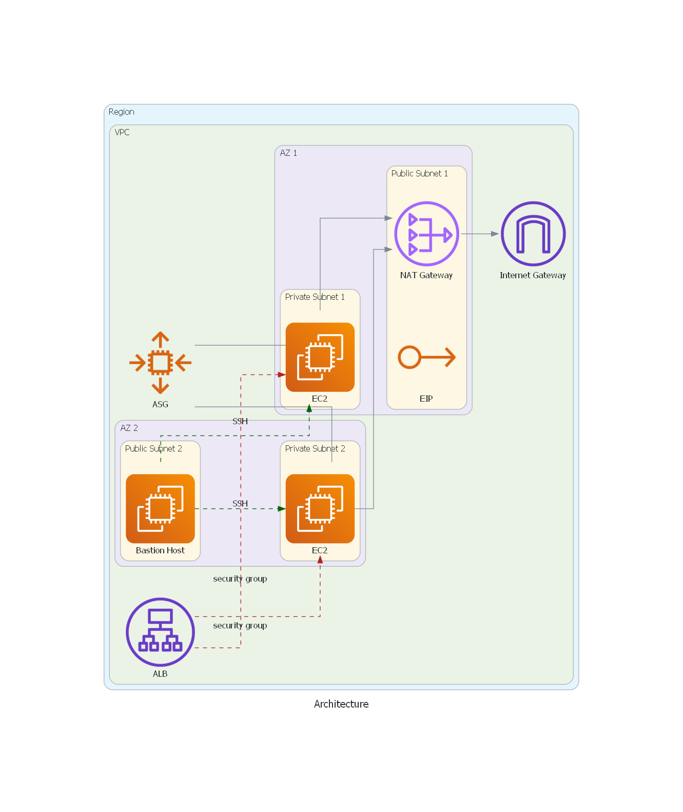

# App

Installation instructions:

Prerequisites: 
Make sure input values are provided in terraform.tfvars

**Important**: Access_key and secret_key should not be added in terraform.tfvars for security reasons.

Hence input those values as prompted while executing terraform plan and apply commands.

Deployment Instructions:

- git clone https://github.com/RahulThammu/App.git  
- Make sure your in folder App  
- Run command: terraform init  
- Run command: terraform plan -var-file="terraform.tfvars"  
- Run command: terraform apply -var-file="terraform.tfvars" --auto-approve  

Steps and Explanation:

1. Create the provider file (This deployment doesn’t have tfstate file stored anywhere, however, AWS S3 or Azure Blob is a recommended  storage option. Create a difference VPC and store the tfstate file in S3 if possible. Provide the details in provider.tf)
	
	Filename: provider.tf

2. Create VPC for the deployment 
    
    Filename: vpc.tf

    

3. Create subnets (Public & Private)

    Public subnets - These are required for attaching the Application Load Balancer  and the bastion host to ssh into EC2 instances in the private subnet

    Private subnets - These subnets are required for creating EC2 instances where the web app will be deployed

    Filename: subnets.tf

    

4. Create Internet Gateway for public subnet resources to communicate with internet

    Filename: internet-gateway.tf

    

    Create a route table for the public subnets and add a routing rule 

    This routing rule redirects all the traffic in the subnet to the internet gateway. The internet gateway then communicates with the internet.

	Filename: route_table.tf

    

    Associate the route table with public subnets

    Filename: route_table_assoc.tf

    

5. Create NAT Gateway for the private subnet resources

    The resources in the private subnet (EC2 instances here ) can access the internet using the NAT gateway deployed in the public subnet

    Filename: nat-gateway.tf

    

    Also, create the Elastic IP and attach it to the NAT Gateway. Since we can’t use the private IP addresses of resources in the private subnet to communicate with the internet, this Elastic IP is required.

    Filename: eip.tf

    

    Create route table for private subnets and add a routing rule

    This routing rule redirects all the traffic in the subnets to the NAT Gateway and then will be communicated with the outside world.

    Filename: route_table.tf

    

    Associate the route table with private subnets

    Filename: route_table_assoc.tf

    

6. Identify the resources required in the public subnet
    - Bastion host - EC2 instance
    - Application Load Balancer
    - Security group for Bastion Host
    - Security group for Application Load Balancer (ALB)

7. Create the above identified resources 
	
	- SG Bastion Host - Allows SSH from anywhere

    Filename: bastion_host.tf

    

    - SG ALB - Allows HTTP traffic from anywhere

    Filename: alb_sg.tf

    

    - Bastion Host - It is created in one of the public subnets

    Filename: bastion_host.tf

    - ALB - An ALB is created along with a Target Group and a listener to listen to traffic on port 80

    Filename: alb.tf

    

8. Identify the resources required in private subnets
    - Auto Scaling Group (ASG)
    - EC2 Instances (Launched with launch-template from ASG)
    - Key-pair for ssh login (A key pair is created and the key name is passed to ec2 instance from launch template - Filename: keypair.tf)
    - EC2 Instances - Security Group
    - Web app deployment 

9. Create the above identified resources

	- EC2 - Security group - The EC2 instances allow SSH traffic from bastion host and HTTP traffic from ALB (This also helps the health checks)

    Filename: ec2_sg.tf

    

    - ASG - An auto-scaling group spanning the two Availability zones is created. The desired, max and min capacity is specified. 

    A launch template with EC2 requirements is also created. It contains the AMI to use for EC2 creation, instance type, key-pair, ec2 user data script, security group etc. This creates the EC2 instances in the private subnets with desired capacity

    Filename: asg.tf

     

    - Web app deployment - This is done using docker-compose file included in EC2 user-data. The user-data filename is container-setup.sh. This file is passed to EC2 user-data as part of the launch template mentioned above.

     

    The user-data runs during the startup of the EC2 instance. This script installs docker-compose, pulls the nginxdemo image and maps localhost port (which is ec2 instance)  3306 with docker container port 80.

     

10. Access web app from the ALB url printed from outputs.tf file at the end of deployment

    

- For securing access to web application, it is placed in private subnets and an application load balance is placed in the front without exposing it to the internet.

-Also, ssh it these web server EC2 instances is allowed through bastion host only

- A dns record and ssl certificate could be created and attached to the load balancer, instead of using ALB's dns name (attempted, but certificate stays in pending validation for a long time)

- Recommendations:

For providing more security against common web applications attacks like cross site scripting, DIstributed Denial of Service etc a Web application firewall (WAF) can be configured. It can handle malicious traffic even before it reaches the web app/ALB.

