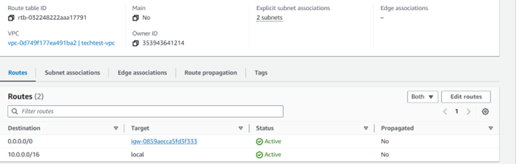

# App

Installation instructions:

Prerequisites: 
Make sure input values are provided in terraform.tfvars

**Important**: Access_key and secret_key should not be added in terraform.tfvars for security reasons.

Hence input those values as prompted while executing terraform plan and apply commands.

Deployment Instructions:

- git clone https://github.com/RahulThammu/App.git  
- Make sure your in folder App  
- Run command: terraform init  
- Run command: terraform plan -var-file="terraform.tfvars"  
- Run command: terraform apply -var-file="terraform.tfvars" --auto-approve  

Steps and Explanation:

1. Create the provider file (This deployment doesn’t have tfstate file stored anywhere, however, AWS S3 or Azure Blob is a recommended  storage option. Create a difference VPC and store the tfstate file in S3 if possible. Provide the details in provider.tf)
	
	Filename: provider.tf

2. Create VPC for the deployment 
    
    Filename: vpc.tf

    

3. Create subnets (Public & Private)

    Public subnets - These are required for attaching the Application Load Balancer  and the bastion host to ssh into EC2 instances in the private subnet

    Private subnets - These subnets are required for creating EC2 instances where the web app will be deployed

    Filename: subnets.tf

    

4. Create Internet Gateway for public subnet resources to communicate with internet

    Filename: internet-gateway.tf

    

    Create a route table for the public subnets and add a routing rule 

    This routing rule redirects all the traffic in the subnet to the internet gateway. The internet gateway then communicates with the internet.

	Filename: route_table.tf

    

    Associate the route table with public subnets

    Filename: route_table_assoc.tf

    

5. Create NAT Gateway for the private subnet resources

    The resources in the private subnet (EC2 instances here ) can access the internet using the NAT gateway deployed in the public subnet

    Filename: nat-gateway.tf

    

    Also, create the Elastic IP and attach it to the NAT Gateway. Since we can’t use the private IP addresses of resources in the private subnet to communicate with the internet, this Elastic IP is required.

    Filename: eip.tf

    

    Create route table for private subnets and add a routing rule

    This routing rule redirects all the traffic in the subnets to the NAT Gateway and then will be communicated with the outside world.

    Filename: route_table.tf

    

    Associate the route table with private subnets

    Filename: route_table_assoc.tf

    

